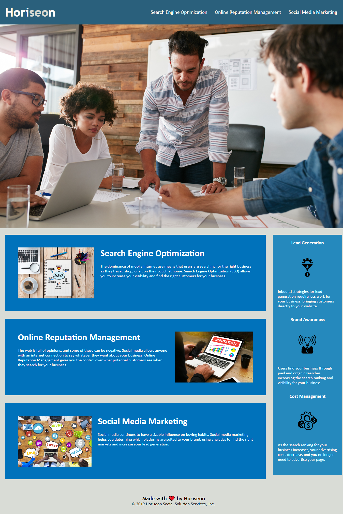

# HTML-Git-CSS-Challenge

## Description
In this project I tried to understand the accessibility aspect of web development and refactor it.
I built this project in order to better understand in practice how to design web-sites, learn new technologies for me and languages of web development.
This project shows how simple it can look like a properly structured web page, how to make the code more readable and practical, and how easy it is to configure CSS styles with minimal skills and knowledge.
I learned to understand the initial code and how to change it.

## Installation
Upload index.html, license.txt, and assets to the deployable web server. The asset catalog contains images and CSS files.
The detailed website associated below has been deployed using GitHub pages.

## Links

*[Link to optimized site](https://paul-dimenshion.github.io/HTML-Git-CSS-Challenge#link-to-optimized-site)
*[Link to corresponding repository in GitHub](https://github.com/Paul-Dimenshion/HTML-Git-CSS-Challenge.git#link-to-corresponding-repository-in-GitHub)

## What had been done
*✅ Correct title for document was added
*✅ The logical structure of the HTML-document was constructed.
*✅ Replaced HTML elements with semantic HTML elements.
*✅ Alt text was added to images.
*✅ Comments on the changes were added to the HTML document.
*✅ CSS was reorganized to follow a logical structure.
*✅ Classes and elements were divided, then ordered alphabetically within each group.
*✅ Comments on the changes were added to the CSS document.

## Usage
After deployment, the application can be viewed in a traditional desktop web browser. It is not yet optimized for mobile, tablets or small screens. 

## Credits

The work was performed in accordance with the specifications and instructions, which are compiled by the teaching staff of UNB Bootcamp.

## Licence
MIT License

Copyright (c) [2022] [Pavlo Demenshyn]

Permission is hereby granted, free of charge, to any person obtaining a copy
of this software and associated documentation files (the "Software"), to deal
in the Software without restriction, including without limitation the rights
to use, copy, modify, merge, publish, distribute, sublicense, and/or sell
copies of the Software, and to permit persons to whom the Software is
furnished to do so, subject to the following conditions:

The above copyright notice and this permission notice shall be included in all
copies or substantial portions of the Software.

THE SOFTWARE IS PROVIDED "AS IS", WITHOUT WARRANTY OF ANY KIND, EXPRESS OR
IMPLIED, INCLUDING BUT NOT LIMITED TO THE WARRANTIES OF MERCHANTABILITY,
FITNESS FOR A PARTICULAR PURPOSE AND NONINFRINGEMENT. IN NO EVENT SHALL THE
AUTHORS OR COPYRIGHT HOLDERS BE LIABLE FOR ANY CLAIM, DAMAGES OR OTHER
LIABILITY, WHETHER IN AN ACTION OF CONTRACT, TORT OR OTHERWISE, ARISING FROM,
OUT OF OR IN CONNECTION WITH THE SOFTWARE OR THE USE OR OTHER DEALINGS IN THE
SOFTWARE.